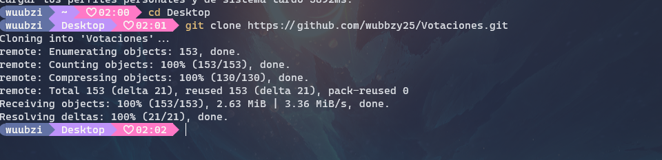
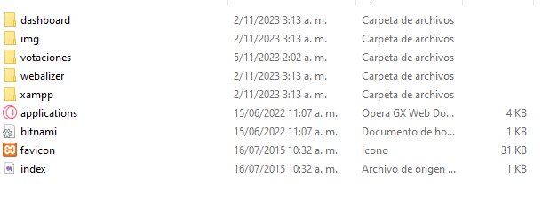
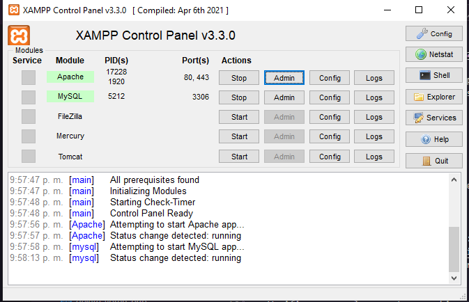
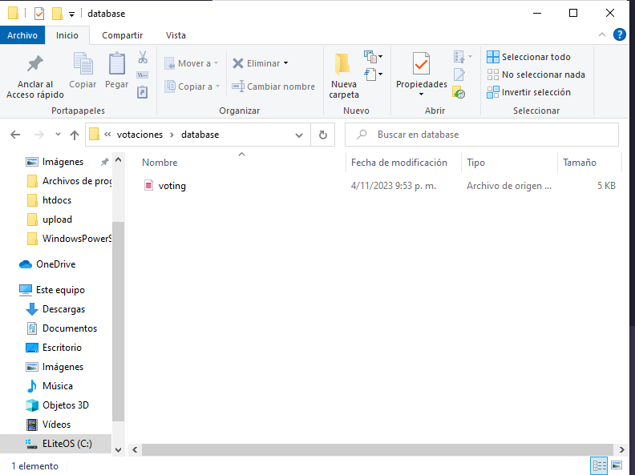
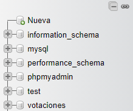
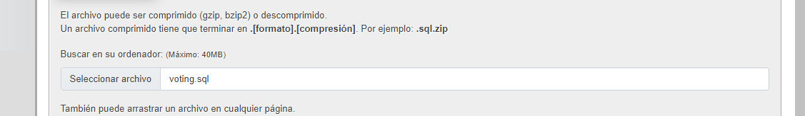

# Software De Votaciones Para IEVE

## Introduccion

Este software fue creado a partir de php y mysql para facilitar la ejecucion en todos los pc

## Como configurar

Recuerda: Para que el software funcione necesitas tener instalado Xampp y git

- Primero abriremos el cmd (preferiblemente en htdocs de xampp la ruta por defecto es: C:\xampp\htdocs)
  
- Luego ejecutamos el siguiente comando: git clone https://github.com/wubbzy25/Votaciones.git
  Esto nos permitara clonar el repositorio a nuestro pc
  
- Verificamos que la carpeta se subio a htdocs
  
- Abrimos el panel de control de xampp y activamos apache y MySQL
  
- Primero montaremos la base de datos para esto ingresa a la carpeta votaciones que previamente clonamos en htdocs y ingresa a database
  
- Regresamos al panel de control de xampp y damos click a admin en MySQL y creamos una nueva base de datos llamada votaciones (si o si debe tener este nombre)
  
- Damos click a la base de datos y le damos a importar
  
  -Despues seleccionamos la base de datos
  
  Y le damos importa

Y listo ya hemos instalado el configurado ¿que sigue?

## Como usar?

- regresamos al panel de control de xampp y le damos admin a apache y en la ruta despues del primer / escribimos votaciones

- Para votar la ruta es este http://localhost/votaciones/

Creadenciales de votador para testear

- ID: 21241523
- contraseña: 8CCADFqy

- -Y para el admin este es el link http://localhost/votaciones/admin/index.php

Credenciales del admin temporal:

- Usuario: admin
- Contraseña: admin

Muchas gracias :)
