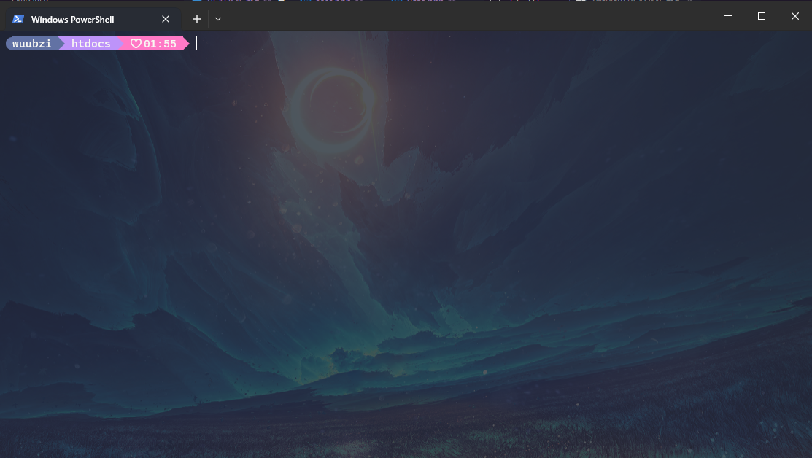

# Software De Votaciones Para IEVE

## Introduccion

Este software fue creado a partir de php y mysql para facilitar la ejecucion en todos los pc

## Como instalar

Recuerda: Para que el software funcione necesitas tener instalado Xampp y git

- Primero abriremos el cmd (preferiblemente en htdocs de xampp la ruta por defecto es: C:\xampp\htdocs)
  
- Luego ejecutamos los siguientes comandos: git clone https://github.com/wubbzy25/Votaciones.git
